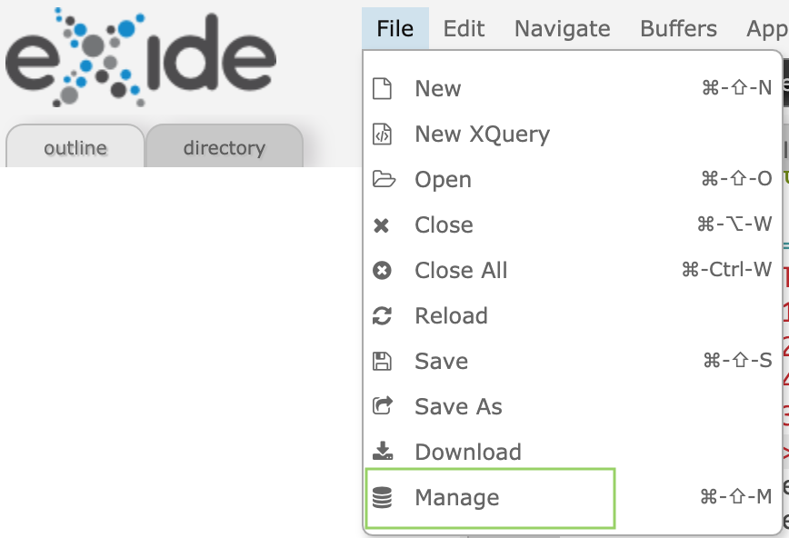
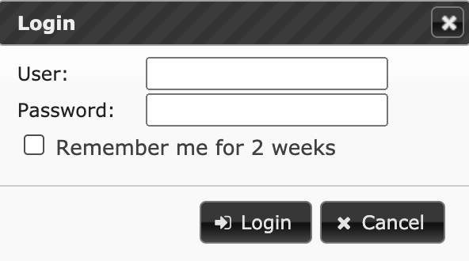
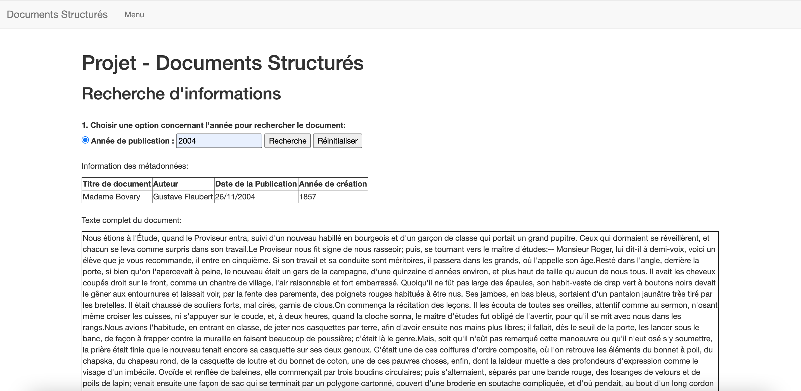
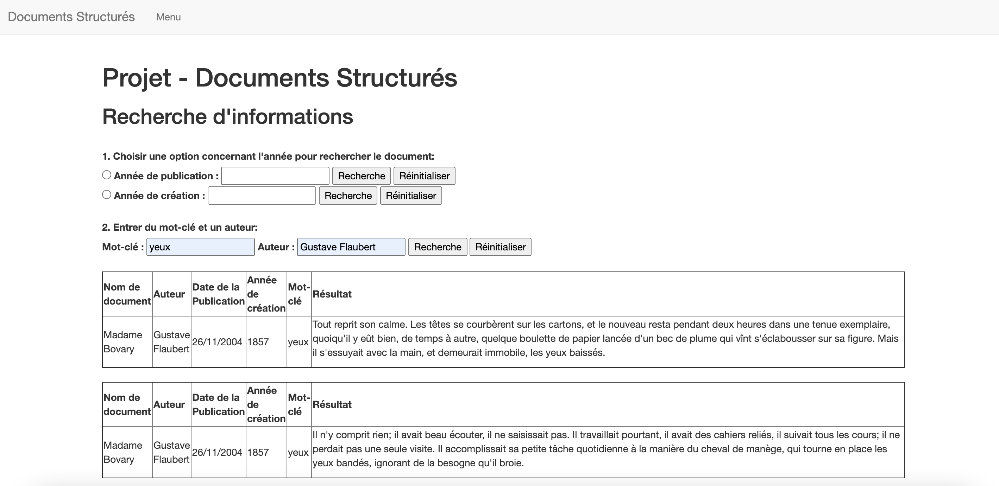
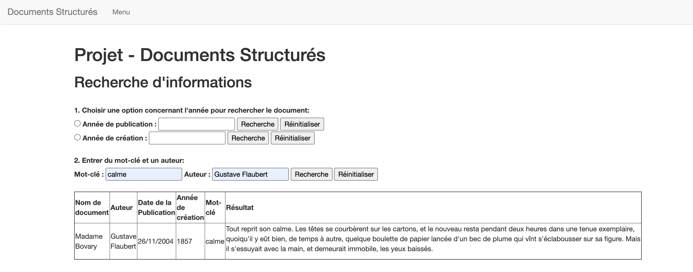
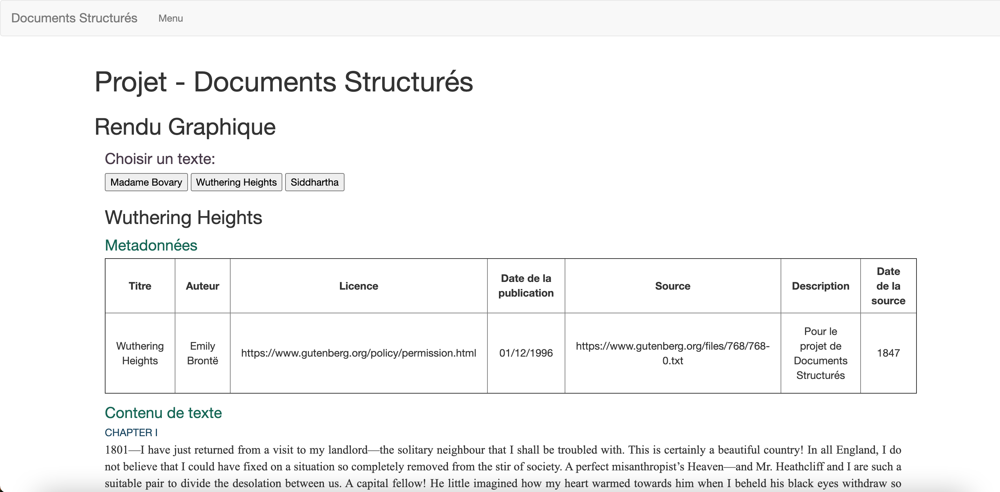

# M2 TAL : Projet Documents Structurés

## Présentation 

Le projet du cours « Documents Structurés » repose sur une chaîne de traitement pour la publication de documents en ligne, il s'agit de trois œuvres littéraires : **Madame Bovary, Siddhartha** et **Wuthering Heights**. Un site web est proposé via la plate-forme eXist-db pour présenter le contenu de ces documents et interagir avec. Plus de détails sur la consigne du projet se trouve [ici](consigne-projet.pdf).

Nous pouvons diviser les missions de ce projet en deux étapes principales. Afin d'exécuter le programme, vous êtes invité(e) à [télécharger l'application eXist-db](http://exist-db.org/exist/apps/homepage/index.html) en fonction de votre système d'opération. [Consultez ici](http://exist-db.org/exist/apps/doc/basic-installation) pour plus d'informations d'installation.

### I. Transformation des documents odt

L'objectif de la première étape est de transformer les documents au format OpenDocument (.odt) en document XML selon le standard de la Text Encoding Initiative (TEI). Pour cela, le schéma TEI permet de valider la structure. D'ailleurs, un SchemaTron permet de respecter l'encodage attendu de certaines métadonnées. En conséquence, les documents sont stockés dans une base de données XML (exist-db). 

Cette étape est largement réalisé à l'aide du logiciel [Oxygen](https://www.oxygenxml.com/), éditeur XML multi-plateforme. Les données pertinentes sont stockées dans le dossier [transformation](transformation).  

### II. Réalisation d'un site dans eXist-db

La deuxième étape appuie sur ces documents transférés et enregistrés à la première étape. Sous l'environnement d'exist-db, un site internet est fait par XQuery et Extensible Stylesheet Language Transformations (XSLT). 

Trois interfaces se sont inscrites dans le cadre du site : une pour la recherche d'informations dans les documents, une pour afficher les documents mise en page et la finale pour présenter le projet. Les fichiers sont enregistrés dans le dossier [tei-editoriale](tei-editoriale).

*****

## Mode d'emploi (pour MacOS)

1. Ouvrez le logiciel exist-db, vous pouvez voir son icône sur la barre verticale en haut, cliquez dessus et choisissez "Start Server", puis cliquez "Open eXide".

2. Maintenant vous vous trouvez dans l'environnement eXide, choisissez "File -> Manage". 

3. Si vous êtes demandé(e) à remplir les informations de login, insérez "admin" comme user en laissant le mot de passe vide. 

4. Vous pouvez désormais gérer les dossiers. Importez le dossier « tei-editoriale » et exécutez le programme en cliquant « Run ».

5. Vous pouvez chercher les informations concernant l’année de publication, l’année de creation, le mot-clé et l’auteur parmi ces trois documents grâce à un moteur de recherche proposé. De plus, vous pouvez également visualiser un rendu graphique de ces trois documents.

Exemples :

*****

*****

*****

*****
Bonne navigation !
